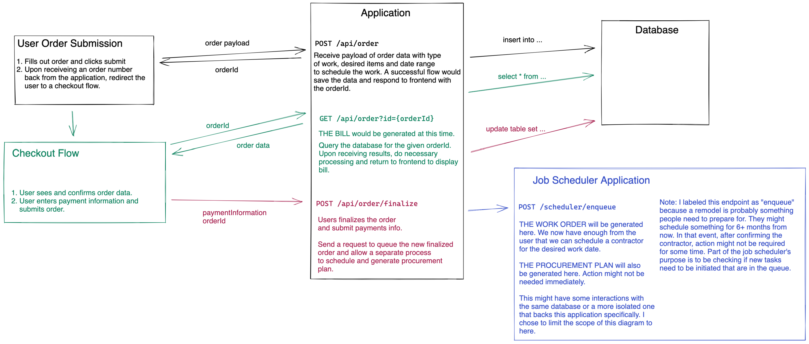

# Block Rennovation Architecture Challenge

## Table of Contents
- [The Database Schema](#the-database-schema)
- [The Primary Documents](#the-primary-documents)
- [API Requests](#api-requests)
   - [POST /api/order](#exmaple-remodel-request-payload)
   - [GET /api/order?orderId={orderId}](#exmaple-checkout-get-request)
   - [POST /api/order/finalize](#exmaple-order-finalization)
   - [POST /scheduler/enqueue](#example-scheduler-enqueue-request)
- [The Diagram](#diagram)

*****
## The Database Schema

This is a JSON representation of some PostgreSQL schema for various tables needed to support basic functionality of the application. We will need to relate users to orders. Beyond that, we will need to relate order materials and labor to their respective entries. Finally a relation will be needed to relate labor to available contractors that work for us.

### User Table
```json
{
   "id": "uuid",
   "first_name": "string",
   "last_name": "string",
}
```

### Order Table
```json
{
   "id:": "uuid",
   "user_id": "uuid", // relation user.id
   "type": "string",
   "materials": "array string", // [material.part_number]
   "labor": "array string", // [labor.id]
}
```

### Material Table
```json
{
   "id": "uuid",
   "name": "string",
   "part_number": "string",
   "price_per_unit": "float",
   "lead_time": "daterange",
}
```

### Labor Table
```json
{
   "id": "uuid",
   "name": "string",
   "min_time_estimation": "int", // internal minimum minutes to complete type of labor
   "type": "string", // this is to help match with contractos ie. contractor A does types x, y, z
}
```

### Contractor Table
```json
{
   "id": "uuid",
   "email": "string",
   "phone": "string",
   "rate_per_hour": "float",
   "availability": "daterange",
   "labor_types": "array string", // labor.type
}
```

*****
## The Primary Documents

### The Query

Disclaimer: I havent written any SQL in over a years time. This is really rough estimate of what the query might looks like.

```sql
with labor_prices as (
   select 
      labor.*,
      con.id as contractor_id
      con.email,
      con.phone,
      con.rate_per_hour,
      con.availability,
   from labor
   inner join contractor con
      on labor.type = any(con.labor_types)
),

select 
   order.*,
   mats.name,
   mats.part_number,
   mats.leadtime,
   mats.price_per_unit,
   lab.contractor_id,
   lab.email,
   lab.type,
   lab.min_time_estimation,
   lab.rate_per_hour,
   lab.availability,
from order
where user_id = $1
   and id = $2
inner join material mats
   on any(order.materials) = mats.part_number
inner join labor_prices lab
   on lab.type = any(order.labor)
```

The goal with the above query is to provide all the data necessary to generate all three documents. 

**The Bill** for the order should be made possible by the materials price per unit added to the labor's minimum time estimation time the contractors rate per hour. This would be a base line to hold on the credit card until a thorough inspection of the job can be made by a professional.

**The Work Order** would be generated using the contractors returned by the query. I am imagining the platform makes the work order available to a list of contractors in the area based on the availability. From there, it would be first come first serve to claim the work order.

**The Purchase Orders** could be generated using the materials data returned from the query. I imagine this purchase order would require hard committment from both the customer and contractor. We can use the leadtime to estimate when the purchase orders should be submitted. (ie. the leadtime is two weeks but the job is scheduled six months from now)

****

## API Requests

### Remodel Request Form

A user will submit a remodel request form. On the form they will give us the room type, the type of work they want done (expansion, remodel, etc). 

The materials will be partially populated by the user and partially populated by the front end application. When they signify they want a new sink bowl and faucet, we already know that our contractors will need waterproof calk for and screws for the installation.

The labor is an estimation based on the request. Since the job type is a remodel and have partial demolition. Any demolition is going to come with waste removal of old materials. Obviously we will have installation as well as clean up when the labor is complete.

A more thorough model of this might include some sort of "units" per labor. Maybe this would only be 1 or 2 units of installation since its only a sink and faucet. Maybe a shower remodel would require 5 or 6 units of installation since its a bigger job. That feels like an extra layer of complexity I didnt want to tackle here.

*****
### Exmaple Remodel Request Payload
`POST /api/order`

**Description**

The endpoint is used to save a preliminary user order and insert the data to the order table. A good request responds with a payload contianing and orderId.

**Example Payload**

```json
{
   "user": {
      "id": 1
   },
   "form": {
      "room": "bathroom",
      "type": "remodel",
      "description": "replace sink",
      "materials": [
         { "part_number": "bowl-123ABC", "quantity": 1 },
         { "part_number": "faucet-987CVB", "quantity": 1 },
         { "part_number": "screws-013HFG", "quantity": 10 },
         { "part_number":  "waterproof_caulk-645PLA", "quantity": 3 },
      ],
      "labor": [
         { "id": "uuid1", "description": "partial_demolition"},
         { "id": "uuid2", "description":  "waste_removal"},
         { "id": "uuid3", "description": "installation"},
         { "id": "uuid4", "description": "cleaning"},
      ]
   }
}
```

**Example Response**

```json
{
   "ok": true,
   "status": 200,
   "orderId": "123ABC"
}
```

*****
### Exmaple Checkout Get Request
`GET /api/order?orderId={orderId}`

**Description**

Get detailed information about the specified orderId.

**Example Payload**

This has no example payload.

**Example Response**

Note: Truncated example.
```json
{
   "ok": true,
   "status": 200,
   "orderId": "123ABC",
   "type": "remodel",
   "materials": [
      { 
         "part_number": "bowl-123ABC", 
         "quantity": 1,
         "price_per_unit": "150.00"
      }
   ],
   "labor": [
      { 
         "id": "uuid1", 
         "description": "partial_demolition", 
         "min_time_estimation": 2, 
         "rate_per_hour": "75.00"
      }
   ]
}
```

*****
### Exmaple Order Finalization
`POST /api/order/finalize`

**Description**

Finalize an order and initiate subsequent document generation in the job scheduling application.

**Example Payload**

```json
{
   "orderId": "123ABC",
   "paymentInformation": "fake_payment_details",
   "desiredStartDate": "09/01/2022"
}
```

**Example Response**

No data response.

*****
### Example Scheduler Enqueue Request
`POST /scheduler/enqueue`

**Description**

Inform the Job Scheduler Application that a new finalized order is ready to enter the work queue of pending orders. It only accepts an orderId and will query for the necessary details as needed.

**Example Payload**

```json
{
   "orderId": "123ABC",
}
```

**Example Response**

No data response.


*****
## Diagram



## Example Tech Stack

If I could pick any tech stack to construct this system it would be React, Redux, Go, and PostgreSQL.

**Frontend**

React and Redux for two reasons: I know them the best and they are very widely used. Wide usage means better support from the community and common problems will already be solved.

I dont believe we need server side rendering for the scope of work the application is trying to accomplish. The pages we are server to the user that is filling out an order dont need to be optimized for search engines so we can simplify things a bit by clearly dilineating between the frontend and the backeng.

**Backend**

I dont have a lot of technical reason to use Go for the backend other than that it will inherently be faster than Node since its a compiled language. It might be a premature optimization but might save some money down the line.

**Database**

I loosley modeled the database as if it were a PostgreSQL instance. I think the data is clearly relational in nature and the queries might become very complex especially when dealing with filtering by date ranges and lead times. Personally, I love PostgreSQL as sort of a catch all, perhaps the job scheduler might be backed by something that is more specialized for a queue type of workflow.
